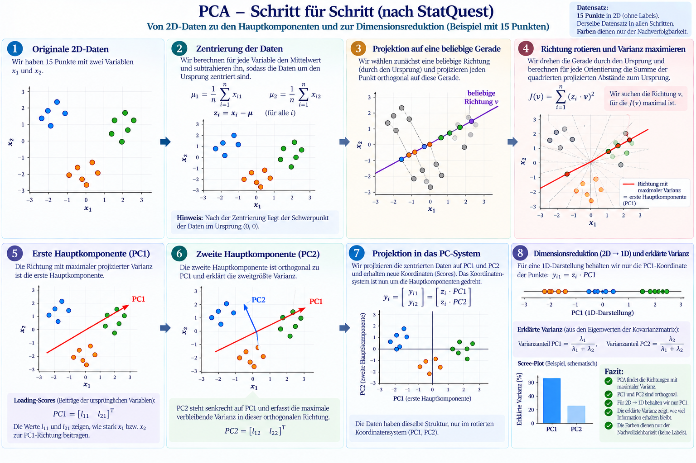

# How PCA works

Principal Component Analysis (PCA) is a linear method for replacing many correlated dimensions with a smaller number of new, orthogonal dimensions called principal components.

In a text dataset, each row can be one document or parliamentary utterance, and each column can be one dimension of its Sentence Transformer embedding. For example:

```text
100 utterances x 384 embedding dimensions
                 ↓ PCA
100 utterances x 2 principal-component coordinates
```

The figure below illustrates the process with 15 points reduced from two dimensions to one.



## 1. Start with the data

PCA begins with a data matrix `X`. Each row is an observation and each column is a variable.

For the ParlaMint example:

```text
row    = one grouped utterance
column = one embedding dimension
value  = the utterance's value in that dimension
```

PCA does not use topic labels. It finds structure from the embedding values alone.

## 2. Center the data

PCA subtracts the mean of each dimension from every observation:

```text
X_centered = X - column_means
```

After centering, the average point is at the origin. This makes the directions of variation easier to compare. Standard PCA centers the data; scaling every dimension to unit variance is an additional choice and is not automatically the same operation.

## 3. Find the first principal component

PCA searches for a direction `v` onto which the centered points have the largest variance. Projecting a centered observation `x_i` onto this direction gives a coordinate:

```text
score_i = x_i · v
```

The first principal component, `PC1`, is the direction that maximizes the variance of these scores:

```text
PC1 = direction with maximum projected variance
```

The direction can be obtained from the covariance matrix or, equivalently, from Singular Value Decomposition (SVD). The corresponding eigenvalue indicates how much variance that component explains.

## 4. Find the second and later components

The second component, `PC2`, captures the largest remaining variation while being orthogonal to `PC1`:

```text
PC1 · PC2 = 0
```

The later components are also mutually orthogonal and explain progressively less variance. These components are directions in embedding space, not topics.

## 5. Project the data into the PC system

If the first two component directions are collected in a matrix `W`, the reduced coordinates are:

```text
Z = X_centered · W
```

For two components:

```text
100 x 384  ->  100 x 2
```

Each utterance receives two new coordinates: its position along `PC1` and its position along `PC2`.

## 6. Decide how many components to retain

The explained-variance ratio for component `k` is:

```text
explained_variance_ratio_k = lambda_k / sum(all lambda values)
```

where `lambda_k` is the eigenvalue associated with that component.

If the first two components explain 17% of the variance, their two-dimensional plot shows only that part of the original embedding structure. The visualization can still be useful, but it is not a complete representation of the data.

## Interpreting PCA for text embeddings

In the ParlaMint experiment:

- nearby points in the PCA plot have similar coordinates along the retained global directions;
- extreme values on `PC1` or `PC2` can be inspected to see what kinds of language vary along those directions;
- a component may reflect a mixture of topics, style, discourse function, document length, or other properties;
- PCA does not produce topic labels and its axes do not automatically mean topics such as `healthcare` or `finance`.

PCA emphasizes broad, global variation. This differs from UMAP, which focuses more strongly on preserving local neighborhoods.

## Compact summary

```text
embedding matrix
    -> center each dimension
    -> find orthogonal directions of maximum variance
    -> project observations onto the directions
    -> retain the first n_components
PCA coordinates and explained variance
```

The figure and step-by-step intuition follow the PCA explanation in the referenced video:
[StatQuest: Principal Component Analysis (PCA), Step-by-Step](https://www.youtube.com/watch?v=FgakZw6K1QQ).
