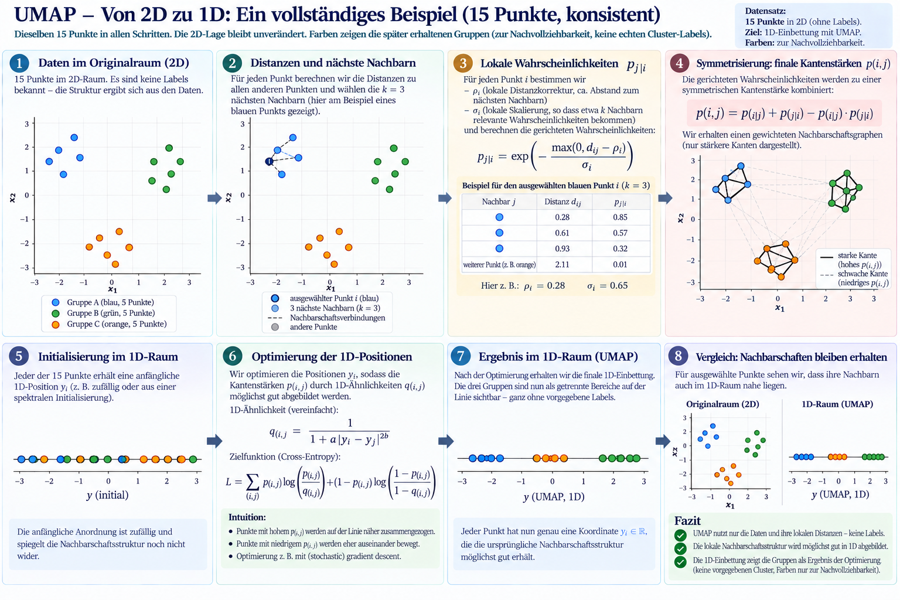

# How UMAP works

Based on: [Understanding UMAP](https://topos.institute/blog/2024-04-05-understanding-umap/)<br>
In a text dataset, each document or utterance is represented by an embedding vector. UMAP uses the distances between these vectors to create a lower-dimensional representation that preserves important local neighborhoods.

The figure below illustrates the process with 15 points reduced from two dimensions to one. In the notebook, the same idea is applied to utterance embeddings, for example from 384 dimensions to two or more dimensions.



## 1. Start with the data and find neighbors

Each point represents one document. UMAP calculates distances between points using a chosen metric, such as cosine distance for Sentence Transformer embeddings. For every point `i`, it keeps its `n_neighbors` nearest neighbors.

This creates a local view of the dataset. `n_neighbors` controls the scale of that view: smaller values emphasize very local structure, while larger values include broader relationships.

## 2. Convert distances into local probabilities

UMAP turns each neighbor distance `d_ij` into a directed membership strength:

```text
p(j|i) = 1                                      if d_ij <= rho_i
         exp(-(d_ij - rho_i) / sigma_i)          otherwise
```

The notation means: how strongly does point `i` consider point `j` to be a neighbor? The value is one inside the local radius and then decays smoothly with distance.

- **`rho_i`** is a local distance offset. It is usually related to the distance from point `i` to its nearest neighbor. Distances below this local radius are treated as maximally connected. This adapts UMAP to different local densities.
- **`sigma_i`** is a local scale or smoothness value. It controls how quickly the membership strength decreases as distance grows. UMAP chooses a separate `sigma_i` for each point so that its `n_neighbors` have a comparable effective neighborhood size; in the standard formulation, their membership strengths approximately sum to `log2(n_neighbors)`.
- **`p(j|i)`** is directional: `i` may consider `j` a strong neighbor even when `j` does not consider `i` equally strongly.

The result is a weighted, directed neighborhood graph.

## 3. Make the graph symmetric

UMAP combines the two directed connection strengths into one undirected edge weight:

```text
p(i,j) = p(j|i) + p(i|j) - p(j|i) * p(i|j)
```

This is a fuzzy union. The resulting `p(i,j)` describes how strongly two documents are connected in the original embedding space.

## 4. Create and optimize a low-dimensional layout

UMAP initializes points in the target space and defines a low-dimensional similarity `q(i,j)` between them. A common form is:

```text
q(i,j) = 1 / (1 + a * distance(y_i, y_j)^(2b))
```

The parameters `a` and `b` are chosen from the requested `min_dist` and `spread`. UMAP then moves the points to make the low-dimensional graph resemble the original graph.

Conceptually:

- pairs with high `p(i,j)` are pulled together;
- pairs with low `p(i,j)` are pushed apart;
- the layout is optimized with a cross-entropy objective, conceptually comparing `p(i,j)` with `q(i,j)`:

```text
loss = p * log(p / q) + (1 - p) * log((1 - p) / (1 - q))
```

The parameter `n_components` determines the target dimensionality. `min_dist` controls how tightly nearby points can be packed in that target space.

The final coordinates are therefore a representation of neighborhood relationships. They are useful for visualization and clustering, but the axes do not have intrinsic meanings and UMAP does not assign topic labels.

## Compact summary

```text
embeddings -> distances and nearest neighbors
local probabilities p(j|i), using rho_i and sigma_i
    -> symmetrization
weighted graph p(i,j)
    -> low-dimensional optimization
UMAP coordinates
```

<!-- The earlier arrow-formatted version is retained below as an internal note.
```text
embeddings
    ↓ distances and nearest neighbors
local probabilities p(j|i), using rho_i and sigma_i
    ↓ symmetrization
weighted graph p(i,j)
    ↓ low-dimensional optimization
UMAP coordinates
```
-->

The figure is a pedagogical illustration of these steps. Real UMAP runs use the same principles with high-dimensional document embeddings and an approximate nearest-neighbor search for efficiency.
